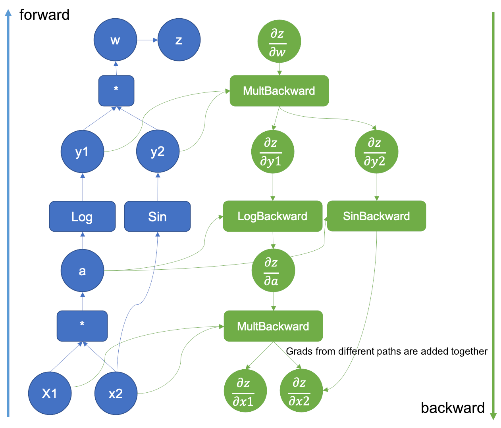

# Grail - Automatic Differentiation Library

A modern C++ automatic differentiation library built from scratch, designed for efficient gradient computation and neural network training.

## Overview

Grail is a lightweight automatic differentiation (autodiff) library implemented in C++ that enables efficient computation of derivatives for mathematical functions. The library implements reverse-mode automatic differentiation, making it particularly well-suited for machine learning applications where you need gradients with respect to many parameters.

## Key Features

- **Pure C++ Implementation**: Built entirely in C++ with minimal dependencies
- **Reverse-Mode Autodiff**: Implements efficient reverse-mode automatic differentiation with computational graph
- **Tensor Operations**: Multi-dimensional array support with automatic gradient tracking
- **Neural Network Layers**: Built-in support for common NN layers (Linear, ReLU, Sigmoid)
- **Convolutional Layers**: Built-in support for 2D convolution
- **Loss Functions**: Includes MSE and Binary Cross-Entropy loss functions
- **Operator Overloading**: Intuitive mathematical expressions using C++ operator overloading

## Architecture

### Core Components

The library is organized into several key modules[2]:

- **`tensor.h/cpp`**: Core tensor class with automatic gradient tracking
- **`node.h/cpp`**: Computational graph nodes for backward propagation
- **`engine.h/cpp`**: Automatic differentiation engine
- **`nn.h/cpp`**: Neural network layers and loss functions
- **`operations.cpp`**: Mathematical operations implementation
- **`utils.cpp`**: Utility functions

### Computational Graph

Grail builds a computational graph during the forward pass and uses reverse-mode differentiation to compute gradients efficiently. Each operation creates nodes in the graph with backward functions that implement the chain rule.<br><br>


## Supported Operations

### Tensor Operations
- **Arithmetic**: Addition (`+`), Subtraction (`-`), Element-wise multiplication, Division
- **Matrix Operations**: Matrix multiplication (`matmul`)
- **Activation Functions**: ReLU, Sigmoid
- **Mathematical Functions**: Square, Square root, Logarithm
- **Tensor operations**: Resize

### Neural Network Layers
- **Linear Layer**: Fully connected layer with weights and bias
- **Activation Layers**: ReLU, Sigmoid
- **Sequential Model**: Container for chaining multiple layers

### Convolutional Layers
- **Conv2D**: 2 Dimensional Convolution supporting arbitary kernel size, stride & padding
- **Max pooling**: Maximum pooling layer to help in reducing dimensions. (Work in progress)

### Loss Functions
- **Mean Squared Error (MSE)**: For regression tasks
- **Binary Cross-Entropy (BCE)**: For binary classification

## Examples

The repository includes two comprehensive examples:

1. **Basic Autodiff Example** (`examples/autograd_example/main.cpp`): Demonstrates basic tensor operations and gradient computation

2. **Iris Classification** (`examples/iris_classification/iris_example.cpp`): Complete neural network training example using the famous Iris dataset

## Performance Characteristics

Grail is designed for clarity of implementation. Key characteristics:

- **Reverse-Mode**: Computational graph is generated during foward pass and traversed backward to calculate gradients
- **Memory Management**: Automatic gradient accumulation and storage
- **Computational Graph**: Dynamic graph construction during forward pass


## Installation

### Requirements
- C++17 compatible compiler (GCC 7+, Clang 5+, MSVC 2017+)
- No external dependencies required

### Build Instructions

Since Grail is a header-based library, you can include it directly in your project:

```bash
git clone https://github.com/ewilipsic/Grail-A_autograd_library_from_scatch.git
cd Grail-A_autograd_library_from_scatch
```

Include the main header in your C++ files:
```cpp
#include "src/grail.h"
```

## Comparison with Other Libraries

Unlike production libraries like PyTorch or TensorFlow, Grail focuses on:

- **Educational Value**: Clear, readable implementation of autodiff concepts
- **Minimal Dependencies**: Self-contained C++ implementation
- **Simplicity**: Straightforward API without complex optimizations
- **Transparency**: Easy to understand computational graph mechanics

## Contributing

Contributions are welcome! Areas for improvement include:

1. **Build System**: Add comprehensive CMake configuration
2. **Documentation**: Expand API documentation
3. **Performance**: Optimize memory usage and computation speed
4. **Operations**: Add more mathematical functions and operations
5. **Testing**: Implement unit tests for all components

## License

This project is available as open source. Please check the repository for specific license information.
